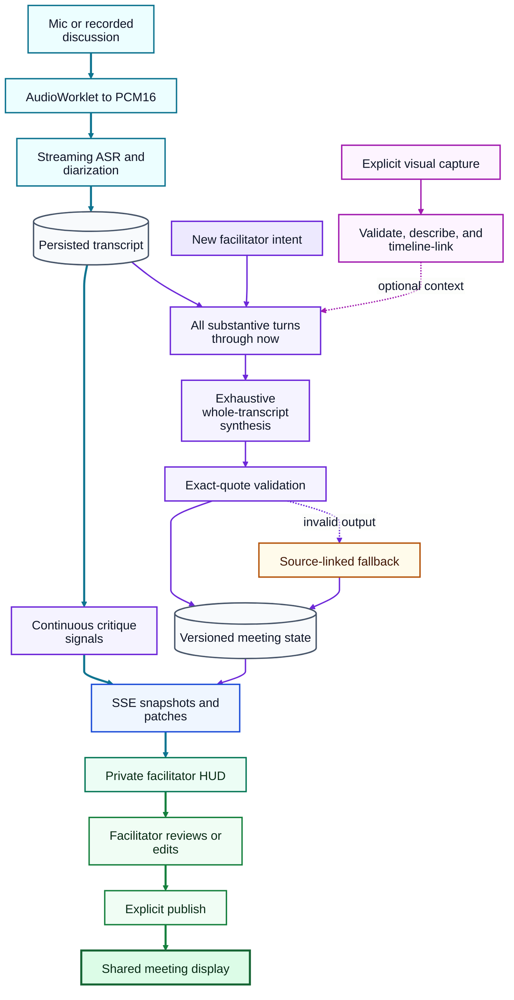

# Critique HUD

A shared cognitive mirror for Design Thinking critiques — a Next.js web application that provides real-time speaker-attributed transcription, discussion mapping, and AI-powered facilitation prompts.

**Deployed:** [huddle-ti5ikw.fly.dev](https://huddle-ti5ikw.fly.dev)

**License:** [Apache License, Version 2.0](LICENSE.md) — open source and
cleared for commercial use, including self-hosted and hosted (SaaS)
deployment. See [License](#license) for details.

## Overview

The Critique HUD supports two modes:

- **Live Mode** — Room microphone → AssemblyAI streaming ASR → live diarized transcript → SSE-driven HUD display + private facilitator controls
- **Simulated Mode** — LLM-generated multi-speaker critique scripts → per-turn TTS → mixed audio stream → tested acoustically (sim C) or via audio injection (sim B)

Both modes drive the same pipeline: audio → worklet → PCM16 → ASR → transcript → analysis → SSE → display.

## Live session AI: readable overview

The live session has two deliberately independent loops. The **capture loop**
keeps accepting audio and persisting transcript turns. The **synthesis loop**
runs only when a facilitator submits an intent, reads an immutable snapshot of
the complete substantive transcript through that moment, and can be repeated
without stopping capture. A third, consent-driven visual path adds individual
frames only after an explicit capture or file-selection action. The
[Live Critique verification guide](docs/live-critique-verification.md) contains
focused diagrams for the repeated-analysis and visual-consent paths.



The cyan spine is uninterrupted capture and private live feedback. Violet is a
repeatable semantic-state revision; magenta is optional visual context; amber
is the safe fallback. Green is the human control boundary: AI interpretations
remain private until the facilitator reviews and explicitly publishes them.

### AI behavior, step by step

```text
                         CAPTURE NEVER PAUSES
                                  |
            Mic / recorded discussion / participant audio
                                  |
                                  v
                       AudioWorklet -> PCM16
                                  |
                                  v
                      Streaming ASR + diarization
                                  |
                         finalized speaker turns
                                  |
                                  v
                      [ Persisted transcript ]
                         |                  |
                         |                  +--> continuous turn signals
                         |                       interruptions, questions,
                         |                       repetition, participation
                         |                              |
                         |                              v
                         |                    [Private facilitator HUD]
                         |
 Facilitator supplies intent, phase, and criteria
                         |
                         v
             [Immutable logical transcript cutoff]
             All substantive turns available at that instant
                         |
              +----------+-------------------+
              |                              |
              v                              v
   Previous meeting-state revision    Optional visual context
              |                       only when explicitly captured
              +--------------+---------------+
                             |
                             v
                 [Structured AI synthesis]
                             |
          +------------------+-------------------+
          |                  |                   |
          v                  v                   v
   Semantic nodes       Relationships      Speaker stances
   issue                supports           agreement targets
   need                 challenges         uncertainty
   proposal             depends_on
   evidence             tests
   question             addresses
   decision             results_in
   action
   experiment
                             |
                             v
                    Exact source anchors
                 turn ID + verbatim quote +
                 speaker + time + confidence
                             |
                             v
                      [Grounding gate]
                             |
             +---------------+----------------+
             |                                |
       output grounded?                invalid / timeout /
             |                         unsupported quote
            YES                               |
             |                                v
             |                   [Deterministic fallback]
             |                    still source-linked
             +---------------+----------------+
                             |
                             v
                  [Versioned meeting state]
                             |
         AI suggestions remain private and require approval
                             |
                             v
                 Facilitator reviews or edits
                title / summary / status / owner
                             |
                    explicitly publish?
                     /              \
                   NO                YES
                   |                  |
           remains private            v
                           Revalidate source quotes
                           against current transcript
                                  /         \
                              valid          stale
                                |              |
                                v              v
                         SSE map.patch    reject and
                                |         resynthesize
                                v
                      [Shared meeting display]

Meanwhile, new transcript turns continue accumulating. The next facilitator
intent creates a fresh cutoff and a new state revision without rewriting the
earlier analysis.
```

Key runtime guarantees:

- Transcript capture does not wait for turn analysis or whole-transcript synthesis; an analysis-provider failure cannot stop already-running audio capture.
- Scrolling away from the newest turn pauses auto-follow and counts unseen turns. “Jump to latest” resumes follow mode without discarding history.
- Every intent submission creates a persisted analysis revision with exact first/last turn IDs, word/turn counts, and a session-relative cutoff.
- Long transcripts are partitioned exhaustively and synthesized from all chunks rather than truncating to the latest screenful.
- Prominent findings and criterion assessments must carry exact substrings from known transcript turns. Invalid anchors are removed; an ungrounded result is replaced by the deterministic fallback.
- The camera is opt-in and preview-only until a facilitator captures one frame. Stored images are type-checked, path-confined, served with `private, no-store`, and treated as context rather than proof about a person.

## Current Status

**Active development — live capture, overlap-aware scenario authoring, natural-audio simulation, repeatable whole-transcript intent analysis, deliberate visual evidence capture, and source-linked critique extraction are implemented. Human disposition, artifact revision linkage, broader real-device evaluation, access control, and production governance remain next.**

| Metric            | Value                                            |
| ----------------- | ------------------------------------------------ |
| TypeScript        | 0 errors                                         |
| Unit tests        | 116/116 passing                                  |
| Live audio E2E    | Mic + recorded pipelines pass locally and on Fly |
| API routes        | 44 endpoints operational                         |
| Frontend pages    | 9 routes functional                              |
| DB schema         | 13 models, SQLite via Prisma                     |
| Production data   | 12/12 scenarios at quality score 100             |
| Scenario audit    | 0 errors, warnings, or exact duplicate lines     |
| Fly.io deployment | 1/1 health checks passing                        |
| API secrets       | `ASSEMBLYAI_API_KEY` + `OPENAI_API_KEY` deployed |
| Dependency audit  | 3 high transitive findings; major fix pending    |

### Build Stage Progress

#### Active live-session upgrade — 2026-08-09T15:43:18Z

- Replaced the earlier live-session plan with the timestamped portrait-first
  speaker-waveform goal and began implementation against the current single-cyan,
  40-pixel audio visualizer.
- Next verification slice: accessible stable speaker colors, substantial live and
  recent-history waveform presentation, portrait layout, and component/unit tests
  before rolling-analysis UI integration.

#### Implementation checkpoint — 2026-08-09T15:58:23Z

- Added a portrait-first live-audio stage that preserves a substantial waveform,
  adds a 30-second history rail, and reconciles its accessible color/marker system
  to finalized speaker turns without implying source-separated audio.
- Reduced the always-on meeting analysis to a compact **Now Lens** while keeping the
  full inspection map reachable on demand; rolling analysis now runs every 10
  seconds or three new turns and streams its analysis window and evidence IDs.
- Unit/type verification is passing. Mobile browser QA confirms all 24 fixture
  turns, three distinct speaker colors, the waveform/history, compact lens, and
  expanded inspector remain reachable without horizontal overflow. Full-suite and
  deployed-app verification are next.

#### Verification resumed — 2026-08-09T23:27:05Z

- Reconciled the workspace with GitHub commits `d34172a`, `98ef39a`, and
  `07250e7`; the portrait waveform, Now Lens, mobile browser assertions, and
  chronological rolling-analysis evidence test are present on `main`.
- Focused unit/type checks and the earlier portrait-browser slice passed. Full
  unit, build, six-profile browser, Fly redeployment, and production live-session
  checks are now in progress; deployment is not yet claimed complete.

#### Multi-speaker waveform completion — 2026-08-10T23:24Z

- Restored bottom-anchored FFT spectral bars for live room audio. Bar color now
  follows the currently attributed speaker while the compact history rail keeps
  finalized speaker attribution visible over time.
- The speaker strip now reserves every configured slot (A–F), distinguishes
  detected speakers from speakers still awaiting voice attribution, and reports
  the detected/configured count instead of collapsing to only the labels already
  returned by streaming diarization.
- Late `SpeakerRevision` events are persisted to matching segmented transcript
  turns and broadcast through SSE. Unit, type, production-build, focused desktop
  audio/revision browser, portrait-browser, Fly health, and HTTP checks passed;
  see the final continuation handoff for exact commit and release identifiers.

| Stage                         | Status         | Summary                                                                                                                                                                                                                                   |
| ----------------------------- | -------------- | ----------------------------------------------------------------------------------------------------------------------------------------------------------------------------------------------------------------------------------------- |
| **1 — Speech proof**          | ✅ Implemented | AudioWorklet PCM16 resampler, `useAudioCapture` hook (getUserMedia + analyser meter + settings readback), ASR WebSocket client (AssemblyAI v3 protocol), wake lock, sendBeacon termination                                                |
| **2 — Diarization**           | 🟡 Partial     | Idempotent turn ingest, word-level provider speaker runs, UNKNOWN/PENDING normalization, overlap hints, mappings, and durable late SpeakerRevision correction work; broader real-room acoustic validation remains pending.                 |
| **3 — Scenarios + stubs**     | ✅ Implemented | Versioned rich transcripts, one-to-three-pass LLM revision, quality gates, ASR/LLM/TTS stubs, realistic overlap fixtures, and recorded-audio injection through the live Worklet/ASR path work.                                            |
| **4 — HUD**                   | 🟡 Partial     | Bounded two-way transcript navigation, controlled auto-follow, live waveform, compact synthesis graphs, whole-transcript intent snapshots, deliberate visual context, SSE, simulation badge, and reconnect work; durable event replay is not implemented.          |
| **5 — TTS + mixing**          | ✅ Implemented | Cached per-turn OpenAI TTS, explicit tone fixtures in stub mode, ffmpeg overlap scheduling/mixing, WAV + MP3 output, manifests, and independent ASR validation.                                                                           |
| **6 — Critique intelligence** | 🟡 Partial     | Batched turn/window analysis, exhaustive whole-transcript synthesis, exact source-quote validation, Critique Radar, criterion coverage, open loops, commitments, and source-linked items work; semantic verification and human disposition remain next.              |
| **7 — Facilitation**          | 🟡 Partial     | Facilitators can revise intent and rerun persisted analysis while audio continues; single-prompt restraint and a lexical guard exist. Correction audit and participant-aware guards remain incomplete.                                      |
| **8 — Evaluation**            | 🟡 Partial     | Playwright covers six device profiles; mic and recorded pipelines have passed local and deployed E2E checks with real ASR. Some reported metrics remain proxies, and a broader physical-device/acoustic matrix is still pending.          |

## Research and system-design study

Peer-reviewed literature, the current implementation, and adjacent 2023–2026 systems have been analyzed as a single design-research program. The program distinguishes published empirical findings, implemented behavior, scaffolding, and future novelty claims.

- [Research artifact index](docs/research/README.md)
- [Research synthesis](docs/research/01-research-synthesis.md)
- [Detailed codebase audit](docs/research/02-codebase-audit.md)
- [Online novelty landscape](docs/research/03-novelty-landscape.md)
- [Seven system versions](docs/research/04-system-versions.md)
- [Evaluation roadmap](docs/research/05-evaluation-roadmap.md)
- [Product and investor assessment](docs/research/06-product-and-investor-assessment.md)
- [Realistic multi-party conversation simulation](docs/research/07-realistic-conversation-simulation.md)
- [Meeting-dynamics visualization research](docs/research/08-meeting-dynamics-visualization.md)
- [Commercial directions](docs/research/09-commercial-directions.md)
- [Timestamped portrait live-session and speaker-waveform goal](docs/goals/2026-08-09T15-25-58Z-portrait-live-session-speaker-waveforms.md)
- [System brief generator](docs/research/generate_critique_intelligence_system.py)
- [Business one-pager generator](docs/research/generate_business_feasibility_one_pager.py)
- [Archived conceptual diagram set](docs/research/archive/diagrams-2026-08-07/)

### New API Endpoints (since prototype)

```
POST /api/sessions/[id]/turns          — Idempotent turn ingest with SSE broadcast
GET  /api/sessions/[id]/events          — SSE with pub/sub integration
GET/POST /api/sessions/[id]/analyses    — Persisted intent snapshots over the complete finalized transcript
GET/POST /api/sessions/[id]/visual-evidence — Deliberate frame capture and timeline linkage
POST /api/sessions/terminate-beacon     — sendBeacon termination endpoint
POST /api/scenarios/[id]/synthesize     — Generate WAV audio from scenario turns
POST /api/scenarios/[id]/revise         — Run 1–3 sequential structured transcript revisions
GET  /api/scenarios/[id]/mixed           — Serve synthesized WAV/MP3 (Range-capable)
GET  /api/sessions/[id]/speech-evaluation — Score WER, SA-WER, overlap WER, and DER
GET  /api/recordings                     — List all synthesized recordings + uploads
POST /api/uploads                        — Upload audio files (WAV, MP3, M4A, WebM, OGG)
```

### New Frontend Features

| Page                       | Features                                                                                                                                                                                                        |
| -------------------------- | --------------------------------------------------------------------------------------------------------------------------------------------------------------------------------------------------------------- |
| `/sessions/new`            | Three audio source modes: Live Mic, Upload File, Past Recording. Browse and select from synthesized scenarios.                                                                                                  |
| `/facilitator/[sessionId]` | Mic/recorded AudioWorklet capture, bounded transcript with pauseable auto-follow, waveform, compact signal HUD, repeatable full-transcript intent analysis, speaker mapping, corrections, and consent-driven visual evidence. |
| `/display/[sessionId]`     | SSE-driven shared HUD with recent turns, Critique Radar, talk share, source-linked discussion map, latest intent synthesis/phase graph, visual context, prompt banner, and SIMULATION badge.                              |
| `/simulator/[runId]`       | Playback controller with speed control (0.5×–2.0×), progress bar, current speaker/turn display, WAV download.                                                                                                   |
| `/scenarios`               | Quality-scored library with duplicate, delete, and launch-to-simulator actions.                                                                                                                                 |
| `/scenarios/[scenarioId]`  | Timed transcript, quality diagnostics, 1–3-pass LLM workshop, synthesis, preflight, approval, and launch controls.                                                                                              |

## Known Issues

### ⚠ Production dependency gate

Compatible updates moved Next.js to 15.5.23, Prisma to 6.19.3, and `ws` to
8.21.3, reducing the production audit from six high-severity findings to three.
`npm audit --omit=dev` still traces those three findings through Next.js
transitive PostCSS and Sharp packages; its advertised automated remediation is
a Next.js 16 major upgrade. That migration is intentionally not folded into
this feature/research phase and remains required before treating the deployment
as production-secure.

### ⚠ Simulation Path

**Status: acoustic playback and injected end-to-end simulation are implemented.**

✅ **What works:**

- Real OpenAI TTS when configured; deterministic tones only in explicit stub mode
- Cached per-turn WAV rendering and distinct voice casting
- `ffmpeg` overlap scheduling, mixing, limiting, and WAV/MP3 output
- Independent ASR validation of sampled real-speech clips
- HTML5 audio playback and visual turn tracking for manual sim C tests
- Browser decoding of an approved mix into the same AudioWorklet → PCM16 → ASR path used by a microphone
- Local and deployed Playwright checks for recorded and fake-microphone sources, including persistence and clean session termination
- Repeated intent snapshots while capture remains active, with exact transcript-quote anchors audited after persistence

❌ **What needs fixing:**

- Simulator actions must persist run/playback lifecycle events
- Browser/device playback needs a broader documented physical-device test matrix
- Evaluation fields currently hardcoded or derived from proxy metrics must be replaced

### ⚠ Overlap Naturalness

**Status: production scenarios use version-2 causal, timing-aware transcripts; deterministic stub dialogue remains a protocol fixture rather than a naturalness benchmark.**

✅ **What works:**

- Stable utterance IDs, response links, dialogue acts, delivery guidance, variable gaps, anchored overlap types/resolution, and post-synthesis realized timing
- Quality gates for duplicate speech, reaction coverage, round-robin order, participation, speaking density, and invalid overlap graphs
- Twelve audited production scenarios score 100 with 33 authored overlaps and no exact duplicate lines, quality errors, or warnings
- Independent ASR validation of the approved Climate mix sampled 11 clips at 0.002 average lexical WER

❌ **What needs fixing:**

- Human evaluation of real generated conversations and overlap naturalness
- Acoustic validation across rooms, devices, distances, and background conditions
- Better overlap speech recovery and three-person diarization (the current production baseline resolves only two stable labels)

## Scenario transcript lifecycle

1. Generation or legacy migration produces a normalized version-2 transcript with session context, stable speakers and utterances, response links, delivery guidance, and planned timing/overlap metadata.
2. The scenario workshop can run one to three sequential structured LLM revisions. Each pass receives the complete transcript and the prior pass result.
3. Normalization and quality gates reject invalid speaker references, duplicate IDs or speech, broken reaction links, contradictory cross-talk settings, impossible overlaps, and participation pathologies.
4. Any material revision returns the scenario to draft, clears stale realized timing and approval/preflight state, and invalidates the old mix while preserving reusable fingerprinted clips.
5. Synthesis renders per-turn speech, measures clips, resolves planned transitions into an absolute timeline, mixes WAV/MP3 output, and records the realized transcript.
6. Independent ASR validation, preflight, and approval apply to that exact fingerprinted mix before playback or a recorded live demo.

## Quick Start

```bash
# Install dependencies
npm install

# Generate Prisma client and create database
npx prisma generate
DATABASE_URL=file:./data/app.db npx prisma db push

# Start development server with explicit zero-cost provider stubs
DATABASE_URL=file:./data/app.db ASR_STUB=1 LLM_STUB=1 TTS_STUB=1 npm run dev
```

Open [http://localhost:3000](http://localhost:3000).

## Configuration

| Variable                    | Purpose                                  | Default                  |
| --------------------------- | ---------------------------------------- | ------------------------ |
| `ASSEMBLYAI_API_KEY`        | AssemblyAI streaming ASR                 | (required for live mode) |
| `OPENAI_API_KEY`            | OpenAI for analysis, generation, TTS     | (required for non-stub)  |
| `DATABASE_URL`              | SQLite database path                     | `file:./data/app.db`     |
| `LLM_STUB`                  | Use deterministic stubs when set to `1`  | unset/off                |
| `ANALYSIS_TIMEOUT_MS`       | Provider deadline before safe fallback   | `12000`                  |
| `ANALYSIS_REASONING_EFFORT` | GPT reasoning effort for live extraction | `minimal`                |
| `SCENARIO_MODEL`            | Structured scenario generation model     | `gpt-5.6-terra`          |
| `SCENARIO_EDIT_MODEL`       | Structured transcript revision model     | `SCENARIO_MODEL`         |
| `TTS_STUB`                  | Use tone-based TTS when set to `1`       | unset/off                |
| `ASR_STUB`                  | Use in-process ASR when set to `1`       | unset/off                |
| `ASSEMBLYAI_SPEECH_MODEL`   | Streaming diarization model              | `u3-rt-pro`              |

## Routes

| Route                      | Purpose                                                                   |
| -------------------------- | ------------------------------------------------------------------------- |
| `/`                        | Home — start live critique, browse scenarios                              |
| `/sessions/new`            | Session setup with audio source selection (mic / upload / past recording) |
| `/facilitator/[sessionId]` | Facilitator controls, live transcript, mic capture, speaker mapping       |
| `/display/[sessionId]`     | Read-only HUD with talk-share, discussion map, prompt banner              |
| `/scenarios`               | Scenario library                                                          |
| `/scenarios/new`           | Generate scenario with topic suggestions                                  |
| `/scenarios/[scenarioId]`  | Review script, synthesize audio, launch simulator                         |
| `/simulator/[runId]`       | Playback controller with SIMULATION badge                                 |
| `/runs/[runId]/results`    | Evaluation results, export                                                |

## Testing

```bash
npm test                    # unit and integration tests, including transcript/ASR/audio gates
npx tsc --noEmit           # TypeScript check
npm run build              # production Next.js build
npm run test:e2e           # cross-browser UI suite plus Chromium mic/recording pipeline cases

# Explicitly authorized deployed mic/recording verification
RUN_PRODUCTION_LIVE=1 BASE_URL=https://huddle-ti5ikw.fly.dev \
  PRODUCTION_LIVE_SCENARIO_ID=<approved-scenario-id> \
  PRODUCTION_LIVE_AUDIO_FILE=<absolute-wav-path> \
  npx playwright test e2e/production-live.spec.ts --project=chromium-desktop
```

The production test now fails when overall WER exceeds `0.45`, speaker-attributed
WER exceeds `0.75`, non-overlap DER exceeds `0.75`, or overlap
speaker-attributed WER exceeds `1.5`. Override those gates with
`MAX_SPEECH_WER`, `MAX_SPEAKER_ATTRIBUTED_WER`, `MAX_NON_OVERLAP_DER`, and
`MAX_OVERLAP_SA_WER`. See the [speech evaluation pipeline](docs/speech-evaluation-pipeline.md)
for metric definitions, the HTTP reporting interface, and interpretation limits.
See [Live Critique verification](docs/live-critique-verification.md) for the
transcript-navigation, repeated-analysis, grounding, mobile, and deliberate
visual-evidence acceptance procedure.

## Architecture

- **One process:** Next.js 15.5 serves UI, API routes, SSE, and background work
- **SQLite via Prisma** (13 models, WAL mode)
- **Local filesystem** for audio assets (`/data/audio/`)
- **SSE** with `src/lib/pubsub.ts` in-memory pub/sub, 15s heartbeat, `Last-Event-ID` reconnect
- **Two external providers:** AssemblyAI (ASR) and OpenAI (LLM + TTS)
- **Stub mode:** All three providers have in-process stubs for zero-cost development

## Deployment

Deployed at `huddle-ti5ikw.fly.dev` via fly.io (Singapore region, shared-cpu-1x, 512MB).

```bash
flyctl deploy --app huddle-ti5ikw
flyctl secrets list --app huddle-ti5ikw   # verify keys deployed
```

## Design Principles

1. **Describe language, never people.**
2. **Every AI output is correctable.**
3. **Restraint:** max 3 labels per turn, max 1 prompt at a time, no confidence percentages on the public display.
4. **Preserve dissent.** Minority positions stay visible.
5. **Transcription survives analysis failure.**
6. **Simulated sessions are unmistakably labelled** with the ◆ SIMULATION badge.
7. **Mobile is first-class.**
8. **Real audio path always.**

## License

This project is open source under the
[Apache License, Version 2.0](LICENSE.md). The license permits commercial
use, modification, distribution, sublicensing, self-hosted and hosted
(SaaS) deployment, and derivative works, subject to the standard Apache-2.0
conditions (notice retention; patent-litigation termination; no trademark
rights in project names or logos).

Third-party software and materials remain governed by their respective
licences, and the runtime providers (AssemblyAI, OpenAI) are governed by
their own commercial terms. See [LICENSE.md](LICENSE.md) for the full text
and scope notes. Contributions are welcome under inbound=outbound Apache-2.0
terms as described in [CONTRIBUTING.md](CONTRIBUTING.md).

## Codex continuation handoff — 2026-08-10T23:24Z

This section is intentionally last. A new Codex session should be able to start
here, confirm the repository state, and continue without reconstructing the
latest work from chat history.

### Current verified baseline

- The latest functional application commit is `870daac` (`fix: complete
  multi-speaker waveform flow`) on `main` in `phuawenpu/huddle`. This README
  handoff is a documentation-only follow-up to that runtime revision.
- Commit `870daac` is deployed to Fly app `huddle-ti5ikw` as release `v46`, image
  `deployment-01KZPZN2GHXZQB1WXC08NQS1TV`, in region `sin`. At handoff the
  machine is started with `1/1` health check passing, and both `/` and
  `/api/time` return HTTP 200.
- Sprite checkpoint `v6` preserves the verified implementation before the Git
  commit and deployment.
- GitHub commit `717fdb7` captured the interrupted work and also added the HUD
  reference image and behavior specification under `workspace/`; those files
  are now tracked repository content, despite the older handoff saying they
  were intentionally untracked.

### What the latest functional change completed

- The live room visualizer again uses the earlier frequency-domain spectral
  bars. Bars share a bottom baseline and extend upward in one direction; their
  color follows the active attributed speaker. The narrow 30-second history
  rail below it is also bottom-anchored and retains finalized attribution.
- Speaker A–F keep deterministic palette colors across the speaker strip,
  spectrum, history, transcript, and semantic contribution UI.
- The top speaker strip reserves the configured number of participants before
  diarization has detected them. A four-person session therefore shows A, B, C,
  and D, with `awaiting voice` on unresolved slots and an explicit detected/total
  count, instead of visually collapsing to only A and B.
- Provider `SpeakerRevision` messages are sent to the turns API, matched by
  provider session and turn order, applied to each overlapping persisted
  segment, reconciled with speaker mappings, broadcast through SSE, and merged
  back into client state. Reloading no longer discards a late C/D correction.
- Recorded scenarios map their known participant order to provider labels A–F
  at session creation. Live and uploaded sessions remain unmapped until the
  facilitator/provider supplies evidence, avoiding fabricated identities.
- Existing active-speaker timing fixes remain intact: capture-relative waveform
  timestamps, newest final-word preference, neutral pending state for unresolved
  speech, a short final-speaker hold, and no premature SSE clearing.

### Verification completed

- `npm test`: 16 files, 131 tests passed.
- `npx tsc --noEmit`: passed.
- `DATABASE_URL=file:./data/app.db npm run build`: clean production build passed.
- Chromium four-speaker regression: four top slots rendered; a persisted A→D
  late revision survived page load; D was marked detected; the spectral canvas
  was visible; the UI reported `2/4 speakers detected`.
- Chromium recorded AudioWorklet → PCM → ASR-stub → transcript regression:
  passed, including `A → B → C` active-speaker transitions and distinct colors.
- iPhone portrait regression: speaker waveform, analysis HUD, semantic compass,
  transcript, and human controls stayed reachable within the viewport contract.
- The managed `critique-hud-dev` service was restarted successfully. GitHub push,
  Fly release `v46`, `1/1` health, `/`, and `/api/time` were verified afterward.

The focused browser audio tests use the repository's in-process ASR stub. They
prove the application state flow, durable revision path, audio analyzer, and
responsive UI, but not real-room diarization quality. AssemblyAI streaming
`max_speakers` is a hint rather than a forced exact count, and multi-speaker
accuracy can still depend on turn duration, overlap, room noise, and voice
separation. The UI now exposes that uncertainty instead of inventing C/D labels.

### Continue from here

1. Run `git status --short --branch`, `git log -3 --oneline`, and `fly status
   --app huddle-ti5ikw` before changing anything. Treat `origin/main` as the
   source of truth; a documentation-only commit should immediately follow
   functional commit `870daac`.
2. Perform the next meaningful acceptance test on the deployed app with three or
   four physically distinct speakers and a shared room microphone. Confirm the
   top active state, colored spectral bars, detected/total speaker count, history
   attribution, and finalized transcript labels change together. Do not claim
   real-room validation from stub results.
3. End the session normally and reload it. Confirm any end-of-stream
   `SpeakerRevision` correction remains visible after reload, especially C/D.
4. If the provider still emits only A/B, collect sanitized WebSocket metadata:
   event type, turn order, `end_of_turn`, turn-level label, final-word labels,
   revision labels, and word timestamps. Do not log credentials, raw audio, or
   transcript content. This distinguishes provider diarization limits from UI or
   persistence failures.
5. Do not synthesize missing speaker detections. Keep unresolved configured
   slots as `awaiting voice`. If physical testing establishes that streaming is
   inadequate for four speakers, evaluate an explicit post-session batch
   transcription/reconciliation path as a separate product decision.

### Files to read first

- `src/app/facilitator/[sessionId]/page.tsx` — WebSocket/SSE state ownership,
  configured/detected speaker sets, and revision persistence request.
- `src/lib/client/audio-visualizer.tsx` — bottom-anchored FFT spectral bars.
- `src/lib/client/speaker-waveform-stage.tsx` — expected speaker strip, active
  color, detected count, spectrum, compact history, focus, and navigation.
- `src/lib/client/asr-client.ts` — provider event normalization, word-level
  segmentation, live-edge speaker choice, and `SpeakerRevision` events.
- `src/app/api/sessions/[id]/turns/route.ts` — idempotent ingest and durable late
  speaker-revision correction/broadcast.
- `src/lib/client/speaker-visuals.ts`, `tests/speaker-visuals.test.ts`, and
  `e2e/critique-hud.spec.ts` — palette/expected-label contracts and focused
  browser regressions.
- `workspace/critique-hud.png` and
  `workspace/critique-hud-live-session-ui-behavior-spec.md` — tracked visual and
  behavioral references for the live HUD.

Finally, preserve the current licensing posture. The project is open source
under the Apache License, Version 2.0 and cleared for commercial deployment;
do not change the licence without an explicit maintainer decision recorded in
the repository.
