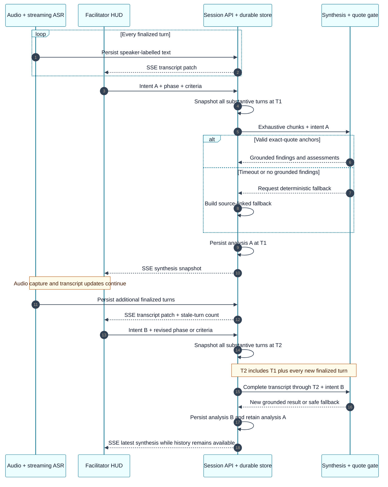
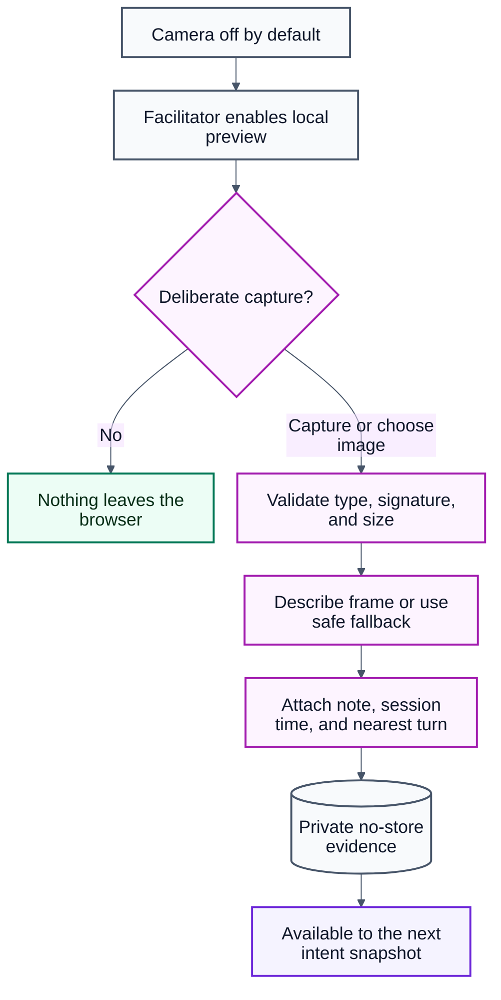

# Live Critique verification

This document is the acceptance procedure for the facilitator's live critique
surface. It covers the behavior that speech metrics alone cannot establish:
transcript navigation, continued capture during repeated analysis, persisted
intent history, transcript grounding, responsive layout, and deliberate visual
evidence capture.

## Interaction contract

- The page and its main regions stay bounded to the device viewport. The live
  synthesis panel and transcript scroll independently.
- The transcript follows new finalized turns only while the viewer is at its
  bottom. Scrolling upward pauses follow and accumulates a visible new-turn
  count; **Jump to latest** resumes it.
- **Analyze all N turns** snapshots every finalized, substantive,
  non-calibration turn through a fixed cutoff. Audio/ASR capture continues while
  synthesis runs. A later intent creates another immutable result over the new
  complete transcript rather than replacing history.
- Model findings, addressed criteria, questions, decisions, and actions survive
  normalization only when they include an exact substring from a real source
  turn. Unaddressed criteria have no sources. The HUD exposes accepted quote
  anchors and rejected-anchor counts are retained in the result.
- The camera is off by default. Enabling it creates a local preview only. A
  facilitator must deliberately capture one frame or choose an image before
  anything is uploaded. The stored frame is linked to the nearest transcript
  turn and session-relative time.

Exact quote validation proves that a result has a real lexical anchor. It does
not prove that the model's interpretation follows from the quote, that a claim
is factually correct, or that a visual caption is accurate. Those remain human
review responsibilities.

## Repeated intent analysis

Audio capture and intent-driven synthesis are separate concurrent processes.
Each analysis reads a new immutable transcript cutoff; it never resets the
stream or overwrites an earlier result.



## Visual evidence consent flow

The visual path is intentionally discrete. Merely enabling the camera does not
upload a stream or frame.



## Visual direction

The implementation adapts the two tracked references rather than copying their
screens literally:

- [`workspace/AR-HUD.png`](../workspace/AR-HUD.png) informed the cyan live-state
  framing, waveform/activity feedback, compact counters, and deliberate
  camera-context layer.
- [`workspace/Non-AR-Analysis.png`](../workspace/Non-AR-Analysis.png) informed
  the transcript-plus-analysis layout, phase allocation graph, findings,
  decisions, questions, and actions.

The result remains a responsive native web HUD. It does not claim continuous
AR scene understanding: visual evidence is intentionally discrete and
consent-driven.

## Deterministic browser checks

Run the focused checks against a local stubbed server or the deployed app:

```bash
BASE_URL=https://huddle-ti5ikw.fly.dev \
npx playwright test e2e/critique-hud.spec.ts \
  --project=chromium-desktop \
  --grep 'long live transcript|live HUD repeats|camera preview' \
  --retries=0

BASE_URL=https://huddle-ti5ikw.fly.dev \
npx playwright test e2e/critique-hud.spec.ts \
  --project=iphone \
  --grep 'iPhone Live Critique' \
  --retries=0
```

These tests seed long discussions, exercise both transcript directions and the
follow pause/resume boundary, run two intents with more turns arriving between
them, reload through the persisted snapshot path, add an image, verify the
shared display, launch a fake camera only after consent, and assert mobile
viewport containment.

## Real recorded-discussion check

Use an approved scenario with its exact local WAV. The test decodes that file
in the browser, sends it through the production AudioWorklet and PCM16 stream,
uses live AssemblyAI diarization, persists finalized turns, and runs two intent
snapshots while the session remains active. It then audits every exposed source
quote against the persisted transcript and obtains WER/SA-WER/DER from the
speech-evaluation endpoint.

```bash
RUN_PRODUCTION_LIVE=1 \
BASE_URL=https://huddle-ti5ikw.fly.dev \
PRODUCTION_LIVE_SCENARIO_ID=<approved-scenario-id> \
PRODUCTION_LIVE_AUDIO_FILE=<absolute-path-to-approved-wav> \
npx playwright test e2e/production-live.spec.ts \
  --project=chromium-desktop --retries=0
```

Production verification on Fly version 41 (2026-08-09) passed without retries:

- recorded session `7894093a-3a19-4fe1-8ff9-94936be2ff5a`: 19 finalized turns,
  two provider labels, and capture continued from an 18-turn/337-word analysis
  to a 19-turn/362-word analysis;
- both synthesis runs used the model and passed exact-substring audits, with
  17 accepted/2 rejected and 22 accepted/1 rejected quote anchors;
- the injected-recording and fake-microphone cases both passed;
- overall WER `0.016`, SA-WER `0.626`, non-overlap DER `0.326`, and
  overlap SA-WER `0.333`.

The high SA-WER/DER relative to WER matters: combined words were accurate, but
the provider produced only two stable labels for three reference speakers and
merged one speaker. This run proves two-label multi-person capture and exposes
the present three-person diarization limitation; it does not prove reliable
identity separation for every participant.

## Privacy and deployment boundary

Visual files are content-type and magic-byte checked, size-limited, stored
under a session-scoped generated path, served with `private, no-store`, and
never expose arbitrary filesystem paths. However, the application currently
has no user authentication or session authorization. Do not use visual capture
for sensitive real-world material on a public deployment until access control,
retention/deletion policy, participant consent, and audit logging are added.
